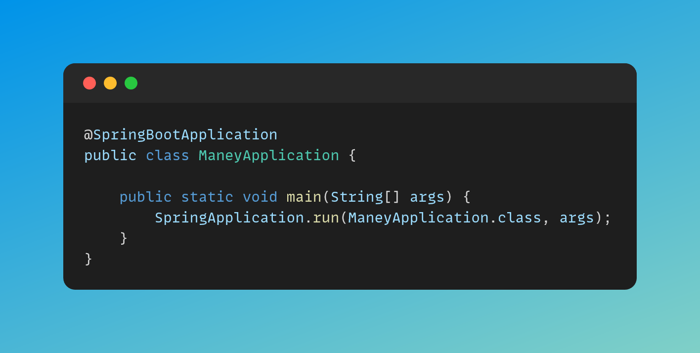

# 💸 Maney 💸

<div style="margin: auto; width:70%">
    
</div>

## 🏝️ Descrição

Construí essa aplicação com o intuíto de gerenciar meus gastos da forma mais facíl. Sem ter de por dados sensiveis, trabalhando
somento com o necessário.
 
## 📃 Documentação

Documentação ficará disponível após a subida da aplicação em <a href="http://localhost:8080/swagger-ui/index.html"> Documentação </a>

## 💻 Pré-requisitos

Antes de começar, verifique se você atendeu aos seguintes requisitos:
* Você precisará de:
*  `Java 17` ☕
*  `Gradle`  🐘

## 🚀 Instalando a aplicação

Para instalar o app, siga estas etapas:


```
gradle wrapper
```

```
./gradlew clean build
```

## ▶️ Subindo a aplicação

Para usar Maney, siga estas etapas:

```
./gradlew bootRun
```


## 🤝 Colaboradores

<table>
  <tr>
    <td align="center">
      <a href="#">
        <br>
        <sub>
          <b>Antonio Junior</b>
        </sub>
      </a>
    </td>
  </tr>
</table>
